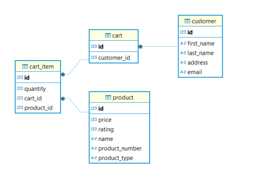
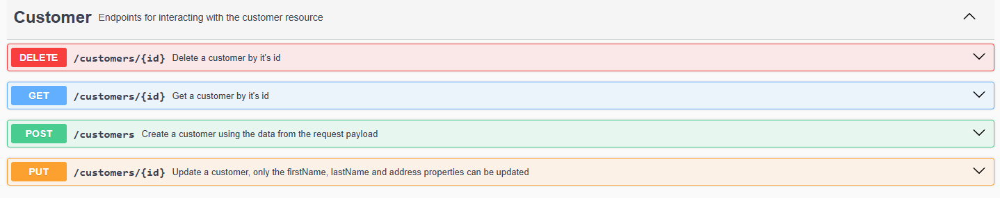
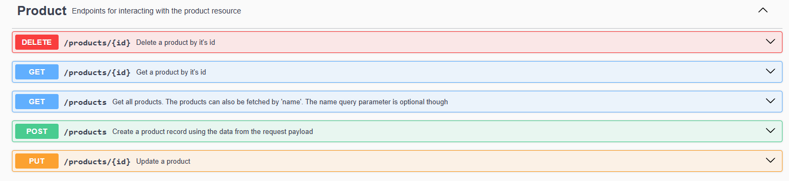
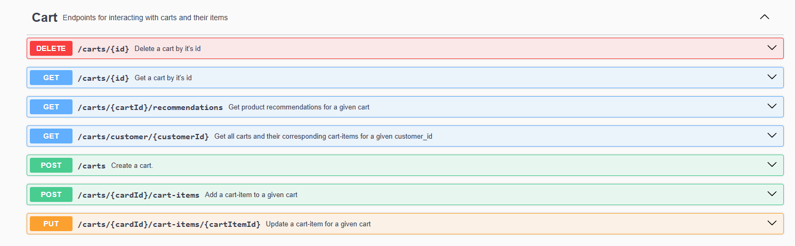

# Cart Management App

### Introduction
This application is a Java Springboot web application in which customers can place products in a shopping cart.

### Project Dependencies
- Java 17
- Maven 3.6.1
- Spring boot 3.4.1
- MySQL 9.1.0
- Docker and Docker compose

### Database Schema 
The current application database schema looks as follows:


### Building application 
You need Java and Maven installed on the host system before you can build the application.  
For specific versions, please refer to the project dependencies section above.


To build the application, at the project root directory run the following maven command:  
```
mvn clean package
```
and to build the application without running unit tests, run the following command instead:
```
mvn clean package -DskipTests
``` 

### Running application
This application requires a MySQL database to run properly.  
To facilitate running and testing the application a docker-compose.yml file is provided. It is configured to pull and execute a MySQL instance and to build and start the app when it's run.
To run the application, you will need to install docker and docker compose on the host machine.  
Then at the project root directory run the following command: 
```
docker-compose up -d
``` 
You should see three (3) containers running if the above commands executes successfully.
- MySQL running on port 3306
- phpMyAdmin running on port 8090
- shoppingCartApp running on port 8080

These ports should be free/available/opened on the host machine.

### Testing the application
The application runs on the base url: `http://localhost:8080`  
The API Swagger UI documentation is accessible usin the url `http://localhost:8080/swagger-ui.html`  
Here is an exhaustive list of the endpoints provided by the application.
#### Customer endpoints:


#### Product endpoints:


#### Cart endpoints:


A Postman collection file named Shopping-cart-management-app.postman_collection.json is found at the root of the project. This can be imported into Postman to get ready to use queries that will facilitate testing the app.